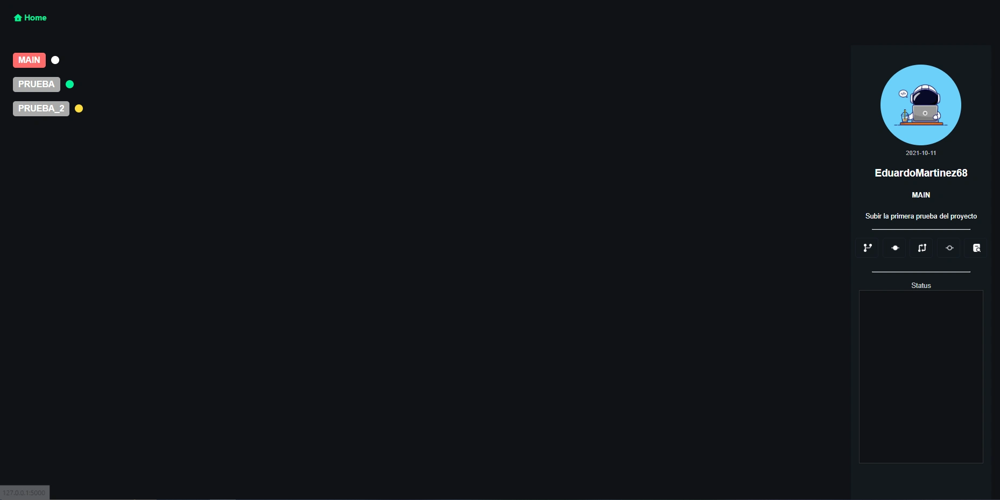
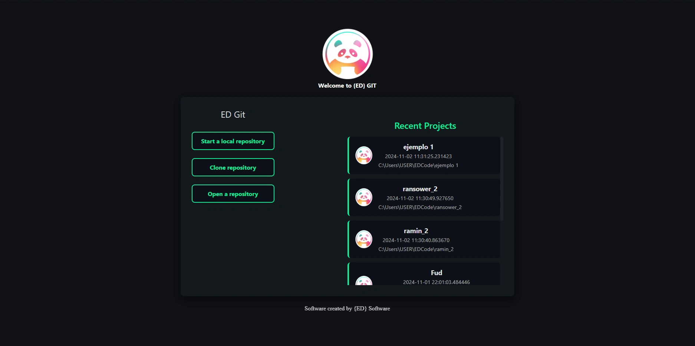
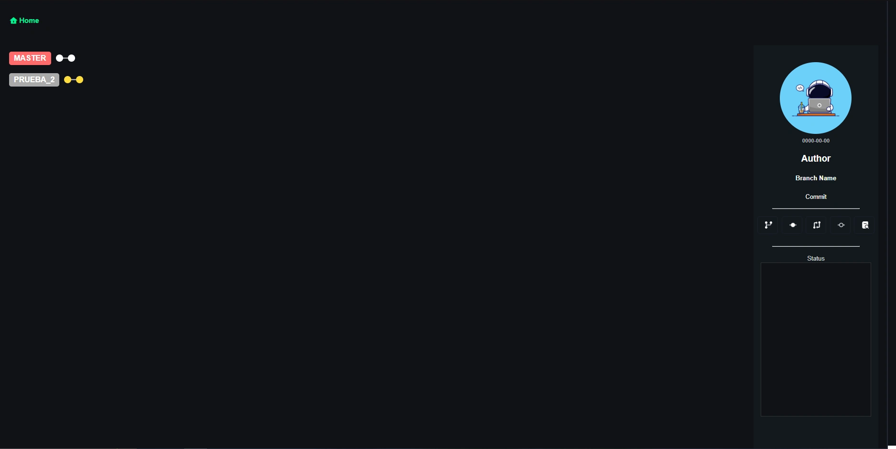
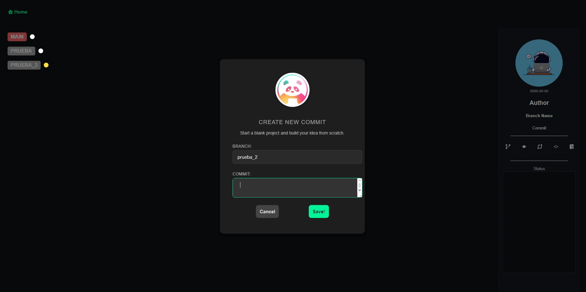
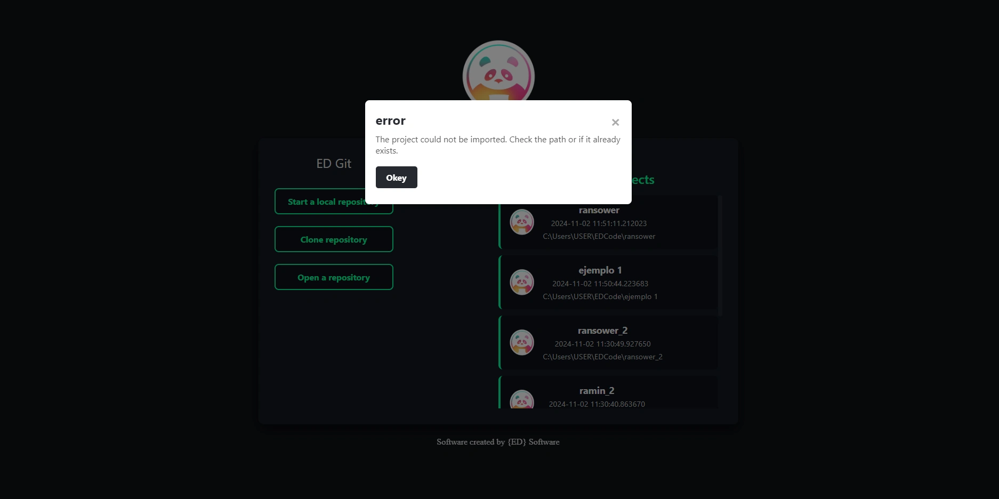

# Sistema Visual para Git en Navegador


## Descripción
Este proyecto es un sistema visual para la gestión de repositorios Git, desarrollado con **Python** y **Flask**, que permite a los usuarios interactuar con sus proyectos de Git de forma más intuitiva a través de un navegador web. El objetivo principal es ofrecer una interfaz fácil de usar que simplifique las operaciones básicas y avanzadas de Git sin necesidad de la línea de comandos.

## Características
- Visualización de ramas y estado del repositorio.
- Capacidad de crear, cambiar y eliminar ramas.
- Realización de commits y control de cambios.
- Integración de mensajes de error y éxito con una interfaz amigable.
- Opciones de importación y clonación de repositorios.
- Soporte para la visualización de la historia de commits.



## Tecnologías Utilizadas
- **Backend**: Python, Flask, GitPython
- **Frontend**: HTML5, CSS3, JavaScript
- **Base de Datos**: SQLite (opcional)
- **Otros**: Jinja2 para plantillas de HTML dinámicas

## Instalación y Configuración
1. Clona este repositorio:
    ```bash
    git clone https://github.com/EduardoMartinez68/ED-Git
    ```
2. Instala las dependencias:
    ```bash
    pip install -r requirements.txt
    ```
3. Inicia la aplicación Flask:
    ```bash
    flask run
    ```
4. Accede a la aplicación en `http://127.0.0.1:5000`.

## Uso
1. Accede a la página principal y selecciona la opción para importar o clonar un proyecto.
2. Visualiza y navega entre las ramas existentes.
3. Realiza operaciones de commit y agrega archivos al área de preparación.
4. Administra y visualiza los cambios realizados en el repositorio.

## Ejemplos Visuales
### Página Principal


### Vista de Branches


### Confirmación de Commit


## Mensajes Flaks


## Contribución
Si deseas contribuir, sigue estos pasos:
1. Haz un fork del proyecto.
2. Crea una nueva rama (`git checkout -b feature/nueva-funcionalidad`).
3. Realiza tus cambios y haz commit (`git commit -m 'Descripción de los cambios'`).
4. Haz push a la rama (`git push origin feature/nueva-funcionalidad`).
5. Abre un Pull Request.

## Licencia
Este proyecto está bajo la licencia [MIT](LICENSE).

